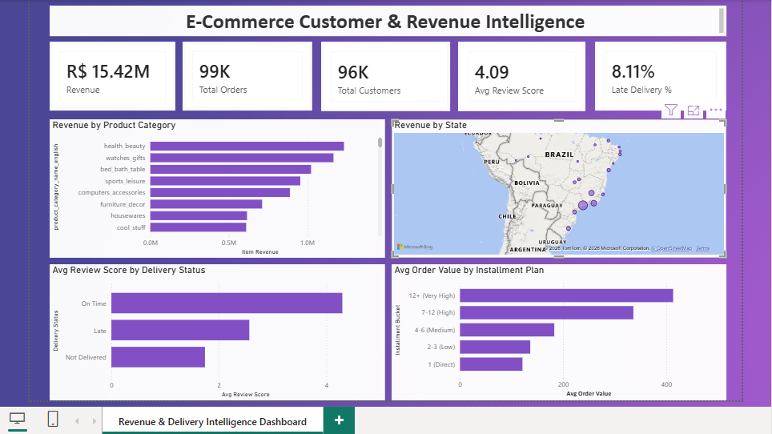

# E-Commerce Customer & Revenue Intelligence

## About this project

I built this project using the Olist Brazilian E-Commerce dataset (public dataset on Kaggle, ~100,000 orders from 2016-2018) to practice SQL analysis on a real, messy dataset and answer some practical business questions about revenue, customers, and delivery performance.

I designed the full database schema myself in MySQL (8 tables with primary and foreign keys), loaded the raw CSV files, and wrote all the analysis queries using CTEs and window functions.

## The pivot: what I expected vs. what I found

Going in, I planned to do a fairly standard RFM (Recency, Frequency, Monetary) customer segmentation. Once I loaded the data and checked it, I found that only about 3% of customers (2,997 out of 96,096) had placed more than one order. This is a business where almost every customer only buys once, so RFM, cohort retention, and customer lifetime value analysis wouldn't really tell an honest story on this data.

Instead, I redirected the analysis toward three areas that actually fit this kind of one-time-purchase business: **revenue concentration**, **delivery performance and its effect on reviews**, and **geographic and payment behavior**.

## Key findings

All revenue figures below are scoped to **delivered orders only** (R$15.42M total) — cancelled/unavailable orders are excluded, since a payment tied to a cancelled order isn't real revenue.

- **Revenue is concentrated at the order level**: the top 10% of orders (by value) make up 38.05% of total revenue.
- **Revenue is spread across categories**: health & beauty leads at just 9.45% of revenue, so no single category is driving the concentration above — it's coming from big individual orders, not one dominant product line.
- **Late delivery hits reviews hard**: orders delivered on time average a 4.30-star review, but late orders drop to 2.57 stars.
- **8.11% of delivered orders arrive late** — a relatively small share, but given the review-score impact above, it's a real driver of dissatisfaction in a business with very few repeat customers to win back.
- **Revenue is geographically concentrated**: Sao Paulo (SP) alone accounts for 38.33% of total revenue — more than the next three states (Rio de Janeiro, Minas Gerais, Rio Grande do Sul) combined.
- **Installment usage scales with order size**: average order value rises from R$121 (paid upfront) to R$413 (12+ installments), so customers clearly use installments mainly for bigger purchases.

*(Note: these figures were originally calculated without the delivered-only filter, giving a total revenue of R$16.01M. After adding the filter for accuracy, every finding above held steady within half a percentage point — a good sign the patterns are real and not an artifact of including cancelled orders.)*

## Dashboard

I also built a Power BI dashboard on top of this analysis, connecting directly to the MySQL database rather than just exporting query results. This meant rebuilding the core logic (installment bucketing, delivery-status classification, revenue aggregation) natively in DAX — including measures, a calculated table (SUMMARIZE), and multi-condition filtering (CALCULATE, SWITCH) — rather than just visualizing pre-computed SQL output.

The dashboard includes:
- KPI cards: total revenue, total orders, total customers, average review score, late delivery %
- Revenue by product category
- Revenue by customer state (map)
- Delivery status vs. average review score
- Installment bucket vs. average order value

## Data cleaning notes

A few real issues came up while loading the raw CSVs that I had to handle directly:
- Two product categories in the products file had no matching translation in the category file. I manually added English translations rather than dropping those products.
- Several numeric and date columns had blank values in the source files, which I converted to proper NULLs during load instead of letting the import fail or insert bad data.
- The reviews file had 814 duplicate review IDs, which I handled by skipping duplicates during load rather than breaking the primary key.

## Tools used

- MySQL 8.0
- SQL: CTEs, window functions (ROW_NUMBER, COUNT/SUM OVER), conditional aggregation (CASE WHEN inside SUM)

## Files

- `ecommerce_revenue_intelligence.sql` — full schema, data loading notes, and all 7 analysis queries with comments explaining the business question each one answers
- `ecommerce_revenue_intelligence.pbix` — Power BI dashboard file, connected directly to the MySQL database
- `dashboard_screenshot.png` — preview of the dashboard, shown above
